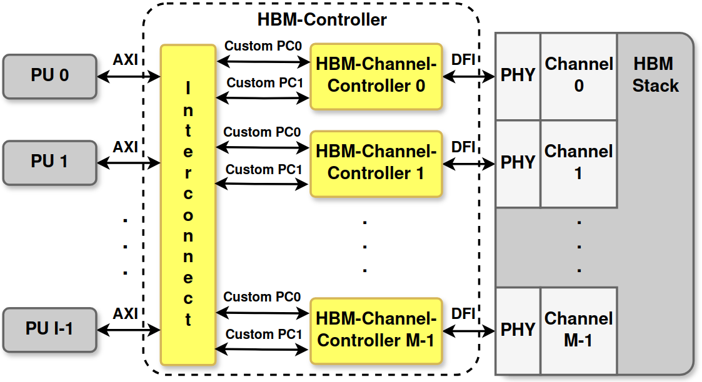
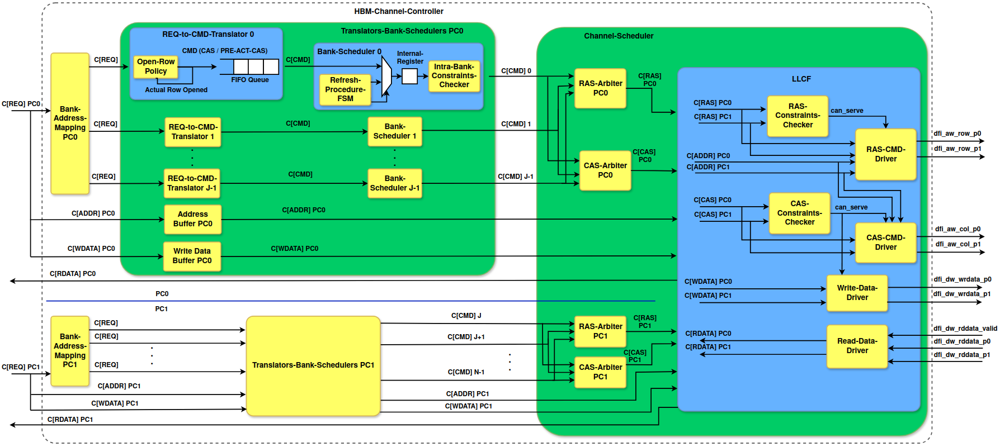
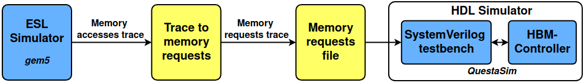

# High-Bandwidth Memory Controller
This project is the RTL implementation of a memory controller for HBM.
The controller uses the AMD Xilinx HBM IP as PHY to talk to the memory through the DFI protocol.
Vivado is needed to build, synthesize, and implement the project. The only tested version is Vivado 2023.2.
HBM IP requires an external simulator. Simulations were conducted using Questa Advanced Simulator v2020.4.

## Controller Architecture
Since each HBM channel is fully independent from the others, each channel has its own HBM-Channel-Controller as shown in the following figure.
At the lowest level (depicted on the right side of the
figure), the HBM stack comprises M independent channels,
each interfacing with the controller via a PHY. Communication
between each PHY and the controller is facilitated through the
DDR PHY Interface (DFI).
HBM-Channel-Controllers interact with the interconnect
fabric using two ports of a custom protocol, one per PC. The
interconnect enables communication between each processing
unit (PU) and all HBM-Channel-Controllers. PUs interface
with the interconnect via the Advanced eXtensible Interface
(AXI) protocol, while the custom protocol follows a conven-
tional valid/ready handshake mechanism.

The architecture of the single HBM-Channel-Controller is shown in the following figure. The figure adheres to a consistent notation
to represent protocols. Each arrow is labeled in the format Pro-
tocol[Data Type], where Protocol specifies the communication
protocol used, and Data Type denotes the type of data being
transmitted. For example, C[REQ] indicates that the custom
protocol is being used to transmit a memory request.

## Getting started

#### Create the build directory
~~~~
mkdir build && cd build
~~~~

#### Configure the project
~~~~
cmake .. -DDEBUG=1
~~~~

Following configuration options are provided:

| Name            | Values                   | Desription                                        |
| --------------- | ------------------------ | ------------------------------------------------- |
| DEBUG           | <**0**, 1>               | If 1 build the simulation project (1 channel only)|
| N_CHANNELS      | <**1**, 2, 4, 8, 16>     | Number of enabled channels                        |
| ADDRESS_MAPPING | <**1**, 2, 3, 4, 5>      | Address mapping policy                            |

The only tested board is the Alveo U280

#### Build the project
~~~~
make HBMController
~~~~
If the simulation libraries are needed:
~~~~
export COMPILE_SIMLIB=1
make HBMController
~~~~
QuestaSim is needed!

#### Synthesize and Implement the project (only if DEBUG=0)
~~~~
make compile
~~~~

## Simulation flow
The default flow is the trace-based simulation flow shown in the following figure.

Basically the SystemVerilog testbench (sim/HBM_controller_top_tb.sv) takes a requests trace in input and sends them (one-by-one) to the controller.

Once the project is built, to simulate it, Questa Advanced Simulator v2020.4 is needed. All the simulation settings are made, you need to download QuestaSim (recommended v2020.4) and compile the simulation libraries if you did not export the COMPILE_SIMLIB variable in the build phase.
Once you have compiled the library you can start a simulation, there is a sample memory trace in the example_traces folder.
To properly start the simulation, the simulation trace must be placed in the (project) directory specified in the testbench.

#### Requests trace
The requests trace could be generated through any tools or flow. The only thing is that it must adhere with the right format that is:
~~~~
REQ ADDRESS [DATA]
~~~~
Where REQ can be WR or RD; ADDRESS is the address the request targeting in hex without any (i.e. 0x) prefix; and DATA is the 32-byte data to write (if REQ is WR) in hex without any prefix.

In the utils directory there are two scripts to generate traces.
The gem5_to_req.py can be used to generate the request trace from a gem5-generated memory trace, while req_to_cmd.py serves to generate a commands trace from a requests trace. This can be used to test the controller without the REQ-to-CMD-Translator component (not recommended).