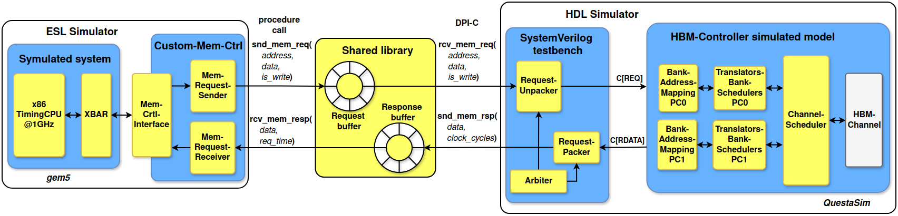

# High-Bandwidth Memory Controller

This project is the RTL implementation of a memory controller for HBM.
The controller uses the AMD Xilinx HBM IP as PHY to talk to the memory through the DFI protocol.
Vivado is needed to build, synthesize, and implement the project. The only tested version is Vivado 2023.2.
HBM IP requires an external simulator. Simulations were conducted using Questa Advanced Simulator v2020.4.
> NOTE: The design has been validated only in simulation. Physical validation is ongoing.

---

## RTL structure and header parameters

Most numeric widths, queue depths, address-map selection, and request-ID sizing are declared as `localparam` symbols in include files under [`src/rtl/include/`](src/rtl/include/). Edit those headers (or the few module `parameter`s noted below), then regenerate the Vivado project.

### [`hbm_controller.svh`](src/rtl/include/hbm_controller.svh)

| Symbol | Meaning |
| ------ | ------- |
| `P_ROW_ADDR_WIDTH` | Row address bit width |
| `P_COL_ADDR_WIDTH` | Column address bit width |
| `P_BA_ADDR_WIDTH` | Bank address bit width |
| `P_BA_N_PS` | Banks per pseudo-channel (half-bank view as in RTL comments) |
| `P_BA_N_G` | Banks per bank group |
| `P_DATA_WIDTH` | Datapath width (bits) |
| `P_TOTAL_PER_CHANNEL_BANK_N` | Bank slots per channel |
| `P_QUEUE_LEN` | Depth of the REQ→CMD translator queue |
| `P_MAPPING_POLICY` | Selects one of five address decompositions in `HBM_channel_controller.sv` |
| `P_WRT_DATA_BUFFER_LEN` | Write-side buffering depth |
| `P_WRT_REQ` / `P_RD_REQ` / `P_REQ_WIDTH` | Request type encoding width and values |
| `P_REQ_ID_WIDTH` | Request ID width (`DEBUG` vs non-`DEBUG` compile) |
| `P_CMD_ID_WIDTH` | Command ID width |
| `LP_BG_N` | Bank groups (derived from `P_BA_N_PS` / `P_BA_N_G`) |
| `P_RD_ID_BUFFER_LEN` | Read ID tracking buffer depth |
| `LP_MRS` | Mode-register-related constant used in the command path |

### [`hbm_timing_constraints.svh`](src/rtl/include/hbm_timing_constraints.svh)

**Per-bank scheduling** (`bank_scheduler` and related):

| Symbol | Role |
| ------ | ---- |
| `tRCD` | Row command to column command delay |
| `tRP` | Precharge period |
| `tRC` | Row cycle |
| `tRAS` | Row active time |
| `tWL` | Write latency |
| `tRL` | Read latency |
| `tRTPl` | Read-to-precharge (long) spacing |
| `tWR` | Write recovery |
| `tBURST` | Burst-related spacing |
| `tRFCpb` | Per-bank refresh cycle |
| `tREFP` | Refresh period |

**Channel / LLCF spacing** (arbiters, forwarders, `channel_scheduler`):

| Symbol | Role |
| ------ | ---- |
| `tCCDl` | Column-column delay (long) |
| `tCCDs` | Column-column delay (short) |
| `tRTW` | Read-to-write turnaround |
| `tWTRl` | Write-to-read (long) |
| `tRRD` | Row-row delay |
| `tFAW` | Four-activate window |
| `tWTRs` | Write-to-read (short) |
| `tRREFD` | Refresh-related spacing |

### [`commands.svh`](src/rtl/include/commands.svh)

DRAM-style opcode constants for RAS/CAS (`P_ROW_ACT`, `P_COL_RD`, `P_COL_WRT`, …), general NOP, refresh, and pseudo-channel helpers (`LP_BA4_0`, `LP_BA4_1`, `LP_PAR`). These normally track the protocol; change only if you extend encoding consistently across the RTL.

### [`dfi_interface.svh`](src/rtl/include/dfi_interface.svh)

Expands to the DFI master port list through the Verilog `` `DEFINE_DFI_MASTER_PORTS` `` macro; no separate timing `localparam` table here.

### Top-level module parameters (outside the SVH bundle)

[`HBM_controller_top.sv`](src/rtl/controller/HBM_controller_top.sv) repeats/overrides a subset of the above as `parameter`s (e.g. `N_CHANNELS`, `P_QUEUE_LEN`, `P_MAPPING_POLICY`, `P_APB_PCLK0_BUFFERED`). CMake drives `N_CHANNELS` into Vivado generics via `build_project.tcl`. [`HBM_AXI_Wrapper.v`](src/rtl/controller/HBM_AXI_Wrapper.v) exposes `MAPPING_POLICY`; keep it aligned with `P_MAPPING_POLICY` in `hbm_controller.svh` when using the AXI path.

---

## Major RTL blocks (short map)

| Area | Primary files | Headers to touch first |
| ---- | --------------- | ------------------------ |
| Clock / MMCM, HBM IP glue, channel replication | `HBM_controller_top.sv` | `hbm_controller.svh`; CMake `N_CHANNELS` |
| Address split, ps0/ps1 datapath, translator + scheduler stack | `HBM_channel_controller.sv` | `hbm_controller.svh`, `hbm_timing_constraints.svh`, `commands.svh` |
| Request → row command queueing | `REQ_to_CMD_translator.sv` | `hbm_controller.svh` (`P_QUEUE_LEN`) |
| Per-bank timing FSM | `bank_scheduler.sv` | `hbm_timing_constraints.svh` (bank group) |
| Bank merge, CAS datapath, read returns | `channel_scheduler.sv`, `llcf_*.sv`, arbiters | `hbm_timing_constraints.svh` (channel/LLCF) |
| AXI front-end | `HBM_AXI_Wrapper.v`, `HBM_AXI_Wrapper_top.v` | Wrapper `MAPPING_POLICY` + `hbm_controller.svh` |
| FPGA pin-minimal top | `HBM_controller_fpga_top.sv` | `P_APB_PCLK0_BUFFERED` on `HBM_controller_top`; CMake `FDEV_NAME` |

Simulation widens `P_REQ_ID_WIDTH` when `DEBUG` is set on the `sim_1` fileset (`cmake .. -DDEBUG=1`); synthesis strips that define so `HBM_controller_fpga_top` stays consistent with the non-`DEBUG` header branch.

---

## Controller architecture

Since each HBM channel is fully independent from the others, each channel has its own HBM-Channel-Controller as shown in the following figure. At the lowest level (depicted on the right side of the figure), the HBM stack comprises M independent channels, each interfacing with the controller via a PHY. Communication between each PHY and the controller is facilitated through the DDR PHY Interface (DFI). HBM-Channel-Controllers interact with the interconnect fabric using two ports of a custom protocol, one per PC. The interconnect enables communication between each processing unit (PU) and all HBM-Channel-Controllers. PUs interface with the interconnect via the Advanced eXtensible Interface (AXI) protocol, while the custom protocol follows a conventional valid/ready handshake mechanism.


The architecture of the single HBM-Channel-Controller is shown in the following figure. The figure adheres to a consistent notation to represent protocols. Each arrow is labeled in the format Protocol[Data Type], where Protocol specifies the communication protocol used, and Data Type denotes the type of data being transmitted. For example, C[REQ] indicates that the custom protocol is being used to transmit a memory request.


---

## Getting started

#### Create the build directory

```
mkdir build && cd build
```

#### Configure the project

```
cmake .. -DDEBUG=1
```

CMake cache knobs (fed into Vivado Tcl):

| Name            | Values                   | Description                                        |
| --------------- | ------------------------ | -------------------------------------------------- |
| DEBUG           | <**0**, 1>               | If 1, enable `DEBUG=1` on the Vivado **sim_1** fileset (wider `P_REQ_ID_WIDTH` in `hbm_controller.svh`); not defined on synth sources |
| N_CHANNELS      | <**1**, 2, 4, 8, 16>     | Number of enabled channels                         |
| ADDRESS_MAPPING | <**1**, 2, 3, 4, 5>      | Verilog defines `ADDRESS_MAPPING_1`…`5` (legacy); active map is `P_MAPPING_POLICY` in `hbm_controller.svh` |
| FDEV_NAME       | **au280**, au50          | Board / part selection (CMakeLists)                |

The only tested board is the Alveo U280.

#### Build the project

```
make HBMController
```

If the simulation libraries are needed:

```
export COMPILE_SIMLIB=1
make HBMController
```

QuestaSim is needed.

#### Synthesize and implement the project (only if DEBUG=0)

```
make compile
```

---

## Simulation flow

Two ways to exercise the RTL in simulation are supported in this tree: file-driven stimulus and a linked gem5+Questa path.

### 1. Trace-driven simulation


[`src/sim/HBM_controller_top_tb.sv`](src/sim/HBM_controller_top_tb.sv) reads a textual trace and applies one request at a time to the controller. After `make HBMController`, use Questa (v2020.4 in our tests); compile Xilinx sim libraries if you did not set `COMPILE_SIMLIB` during the build. Place the trace where the testbench expects it (see `TRACE_FILE` in the TB). Example lines live under [`example_traces/`](example_traces/).

#### Trace file format

```
REQ ADDRESS [DATA]
```

`REQ` is `WR` or `RD`. `ADDRESS` is hexadecimal **without** a `0x` prefix. For writes, `DATA` is 32 bytes of hex, also without `0x`.

[`utils/gem5_to_req.py`](utils/gem5_to_req.py) converts a gem5 memory trace into this format. [`utils/req_to_cmd.py`](utils/req_to_cmd.py) can emit a lower-level command trace (bypasses `REQ_to_CMD_translator`; not recommended for normal validation).

### 2. CrossSim (gem5 ↔ Questa via DPI-C)



**CrossSim** couples **gem5** (system timing model) with **Questa** (RTL) through a small DPI-C shared library, `crosssim.so`, backed by POSIX shared-memory queues. gem5 enqueues loads/stores; the SystemVerilog side dequeues them, drives the custom memory ports of `HBM_controller_top`, and posts responses back.

- **Sources:** [`CrossSim/gem5/`](CrossSim/gem5/) (`DpiMemCtrl` + example `simple.py`), [`CrossSim/crosssim/`](CrossSim/crosssim/) (library build).
- **Procedure:** full build order, gem5 copy list, `compile_simlib`, and `make` for `crosssim.so` are in **[`doc/CrossSim/README.md`](doc/CrossSim/README.md)**.
- **Questa TB starting point:** [`doc/CrossSim/HBM_controller_crosssim_dpi_tb_template.sv`](doc/CrossSim/HBM_controller_crosssim_dpi_tb_template.sv) — declares the DPI imports, calls `initialize` / `finalize`, and instantiates the controller; you still need the request/response loop that maps queue records to `address` / `request` / `write_data` / `request_valid` / `request_id` and back to `questa_send` / `questa_receive` (see `CrossSim/crosssim/inc/crosssim.h`).
- **Note:** Some CrossSim distributions ship ready-made Vivado-oriented SV examples; this repository relies on the template above plus your Questa/Xilinx library setup instead.

Run gem5 and Questa **concurrently** with the same `crosssim.so` path so both sides attach to the shared queues.
